# Use Cases

This section will cover several common tasks, and how to complete them using FreezeTag. 

You can use the section headings on the left (you can collapse/uncollapse this menu with the hamburger button) to navigate to specific tasks.

## Uploading Images

To upload images, navigate to the Upload page. You will see an "Upload Images" button, you can click it to open a file dialog, but drag-and-drop works as well. We support the vast majority of image formats that you are likely to use, based on our use of ImageMagick for processing. Once you upload your images, you will see a progress bar like so:
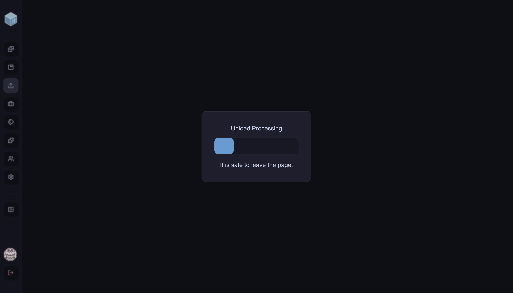
This progress bar indicates that the images have already uploaded to the backend server, but that their metadata is still being extracted and thumbnails are being created. At this point, it's safe to navigate off of the page if you would like, your data will be retained. However, you should not kill the server while this process is occurring.

Once the progress bar completes, you will be greeted with a gallery like this:

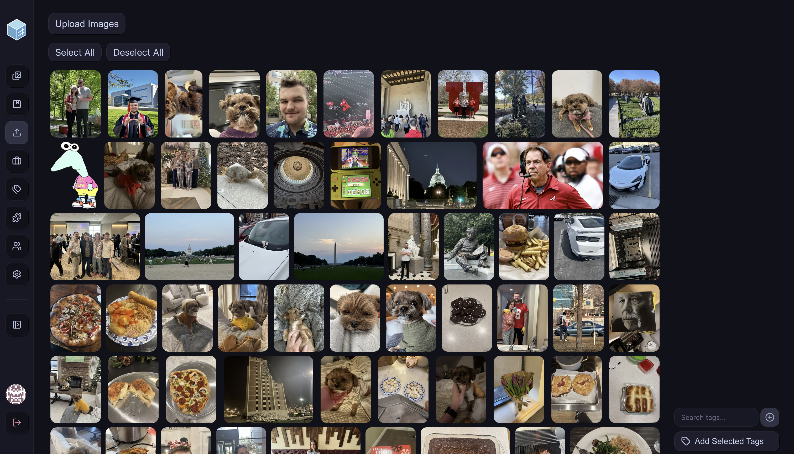

From here, you can manually add image tags. To select the images you want to tag, you can just click on them. Selected images are given a blue border:

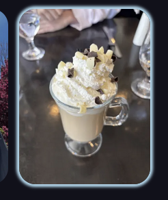

And you can use "Select All" or "Deselect All" to speed up the process. Then, we need to create a tag to give these images. You can type the name of the tag you want into the bar on the bottom right, then click the `+` button to add that tag to the instance:

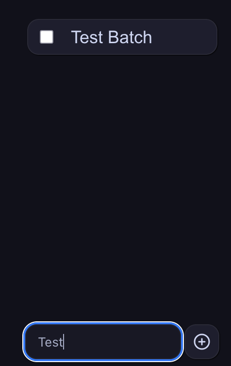

The tag is added to the instance, but isn't yet applied to our selected images. To do so, click the checkbox next to the tag name in the list, and then click "Add Selected Tags". This will apply the tags to your selected images. You can repeat this process for as many tags as necessary, and as many unique images as needed to tag your images exactly the way you want. The bottom bar also acts as a search bar, if you have a lot of tags.

You may notice that new tags appear alongside the tags you added by hand. This is because, by default, we have some automated image tagging plugins enabled. You can view the details about those in [Automated Image Tagging](./use_cases.md#automated-image-tagging).

## Search Images

Images can be easily searched on the main gallery page, with a combination of tag-based searches as well as metadata-based searches.

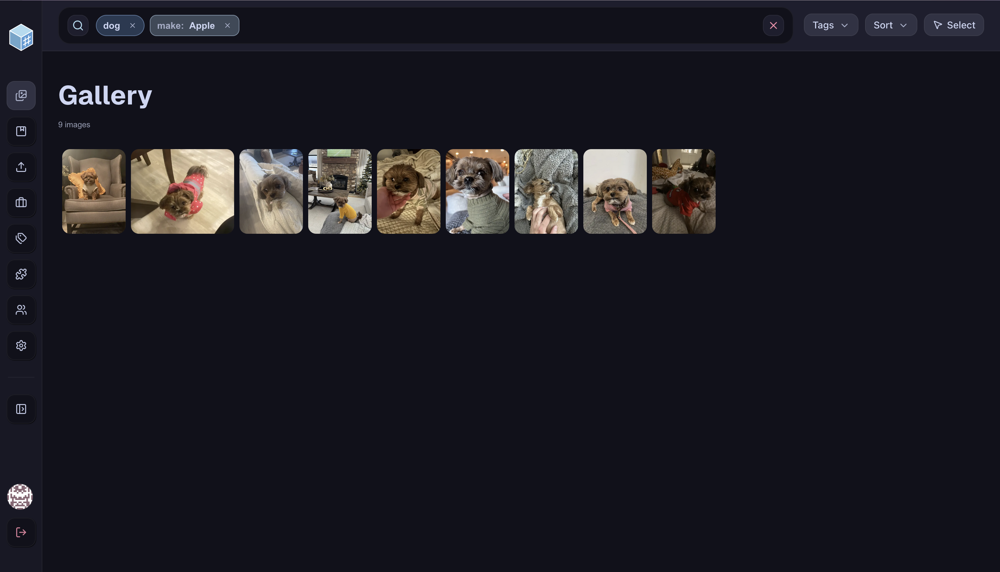

Tags can be searched by typing out the name of the tag. The names of tags are suggested as you search, and you can click the suggestions for autocomplete. Tags can be fuzzy-searched by typing out a partial tag, this will include all tags containing that part. Strict searches can be done by wrapping your tag query in quotation marks. To finish a query, use a semicolon. For example, searching the "dog" tag specifically can be done by typing out `"dog";`.

Metadata can be searched similarly, with the syntax of `<keyword>=<query>;`. Available metadata keywords include: `make` and `model` of the camera, `takenBefore` and `takenAfter` based on the detected photo date, `uploadedBefore` and `uploadedAfter` based on the date the image was uploaded to FreezeTag, and `near` based on the detected photo location. `make` and `model` support the same fuzzy/strict searching syntax as tags, so `make="Apple";` looks for an exact match of Apple cameras. `near` has unique syntax formed by `near=x,y,z;`. `x` and `y` are coordinates, and `z` is a distance specifier. By default, based on your region, `z` is parsed in miles or kilometers, and this can be changed on the Settings page. Format specifiers can also be used, such as `40deg` being used to indicate "within 40 degrees of `x,y`".

The following query searches for images that are taken on a device with any kind of iPhone, contain exactly the tag "graduation", and are within 4 degrees of 40.7°N, 111.5°W.

```
model=iPhone; "graduation"; near=40.7,-111.5,4deg;
```

The "Tags" button to the right opens up a panel showing all tags that are on at least one image with the current search query. The "Sort" button to the right of that button allows the images in the gallery to be sorted based on their dates uploaded or taken, in ascending or descending order. The "Select" button on the furthest right is used in [Modify Images in Batches](./use_cases.md#modify-images-in-batches).

## Modify Single Images

From the main gallery page, click on the image you would like to modify. It will then be displayed in a pop-up panel like the following:

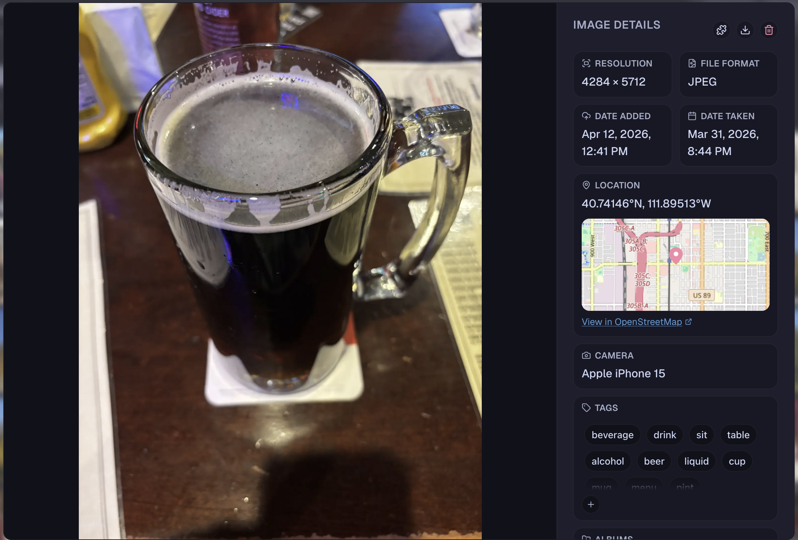

Here, all of the available metadata for the image is displayed, including an OpenStreetMap widget if location data was detected. There are three buttons in the top right. The puzzle piece allows plugins to be ran, which is covered in [Running Plugins](./use_cases.md#running-plugins). The download button will download the original image, in its original format, to your machine. The trash button will delete the image, with a confirmation dialog before the change is finalized.

Near the bottom right, there is a small Tags panel, where tags can be removed or added. Clicking on any of the tag pills will create a search query based on that tag in the main gallery, hovering over a tag will show an X that can be used to remove the tag. To add a tag, click the + button to show a search bar. Search for the tag you would like to add, or type out the name of a brand-new tag, then click the + button here to add that tag to the image.

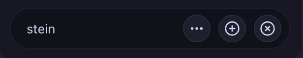

Below the tags panel, there is an Albums panel, where this image can be added to albums. To add the image to an album, type out the name of a currently existing album (or a brand new album), and then click the + icon to create the album (if needed) and then add this image to it.

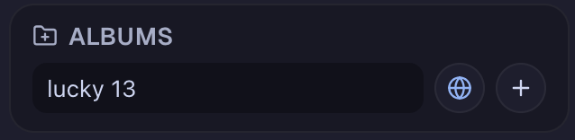

When creating a new album, it is by default public, but you can click the globe button to make it private. Modifying and using albums in more depth is covered in [Albums](./use_cases.md#albums).

## Modify Images in Batches

From the main gallery page, click the "Select" button in the top-right corner to transform the gallery into multi-select mode:

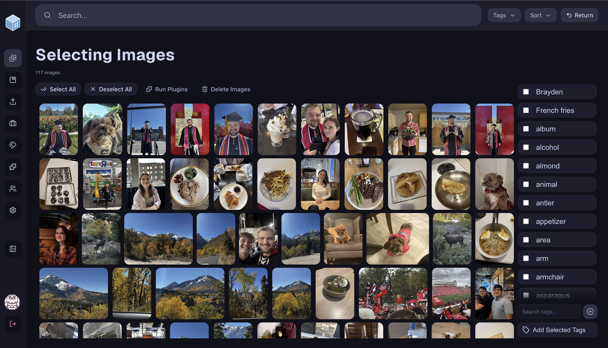

In this mode, the search bar and search options freeze to prevent inconsistencies. If you would like to operate on a smaller set of images, then enter your search query on the main gallery with the guide given in [Search Images](./use_cases.md#search-images), and then click "Select". 

With this new gallery, you can select and deselect images using similar controls as in [Uploading Images](./use_cases.md#uploading-images). In addition, there is a "Run Plugins" button that is explained in [Running Plugins](./use_cases.md#running-plugins), as well as a "Delete Images" button that allows you to delete your selected images.

The tagging capabilities differ slightly from the controls in [Uploading Images](./use_cases.md#uploading-images). Primarily, because it is possible and assumed that the images on this page already have tags, the tag menu will indicate the status of the tags based on your selected images.

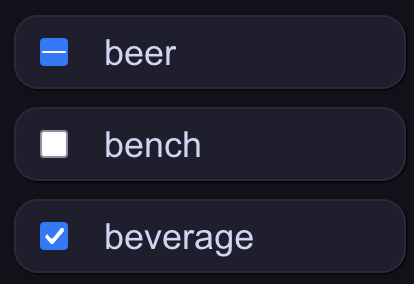

The checkboxes here mean that the tag "beverage" is present on all selected images, the tag "bench" is present on none of the selected images, and the tag "beer" is present on some, but not all of the selected images. To modify the tags, you can use the checkboxes and the search/add bar as in [Uploading Images](./use_cases.md#uploading-images), however the only changes that will apply will be when you click a checkbox and actively change its state to either "all" or "none". When you click "Add Selected Tags", it will apply your changes based on the checkboxes you changed, to all images you have selected.

This page can be left by using the "Return" button, which is in the same place as the "Select" button previously was.

## Running Plugins

When you use one of the "Run Plugins" buttons described in either [Modify Single Images](./use_cases.md#modify-single-images) or [Modify Images in Batches](./use_cases.md#modify-images-in-batches), you will be greeted with this panel:

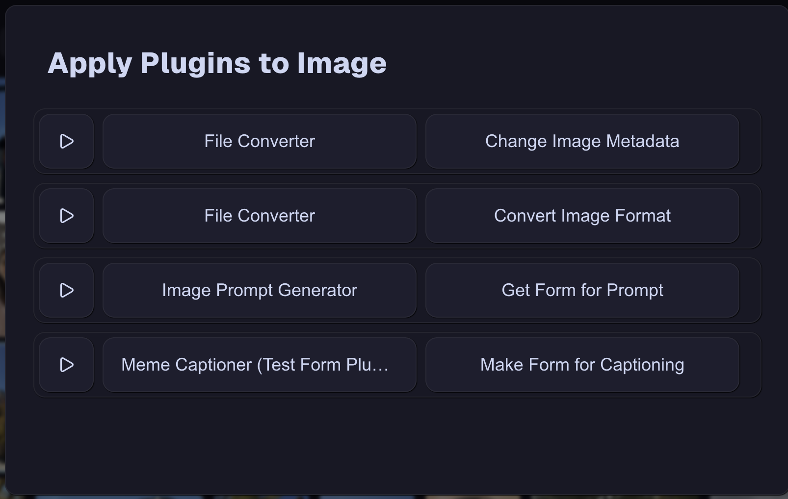

The available plugins will differ, depending on whether you have one image or multiple images selected. If just one image is selected, then it will show all plugins that have a "single image" or "image batch" signature, with either a "manual trigger" or "generate form" hook. If multiple are selected, it does not show those plugins with a "single image" signature.

Choose the plugin you would like to run with the play button next to the plugin name, and it will begin the process of running that plugin. If the plugin does not need any user input, it will show you the [jobs page](./use_cases.md#jobs-page) so you can track the progress of that plugin. If the plugin is designed to work with user input, then it will generate and show you a form to fill out with the input required. Once that input has been given, it will show you the same jobs page.

## Automated Image Tagging

We provide some plugins that automatically tag images, and those can be configured by the user. On an account with the "Write Plugins" and "Read Plugins" permissions (such as the default admin account), navigate to the Plugins page:

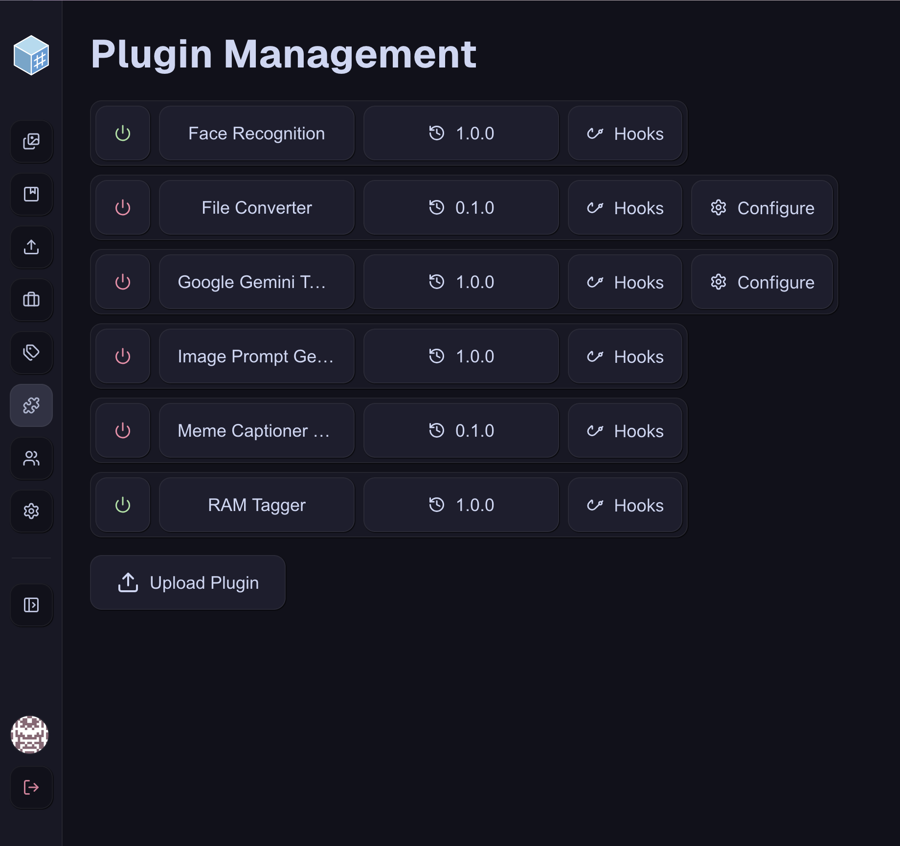

This page lists out all plugins that are installed by default, including the three plugins with "Post Upload" tagging capabilities. Enabled plugins are marked with a green power button, and disabled plugins are marked with a red power button. We provide accessible and custom themes to change these colors, if desired. Refer to [Color Themes](./use_cases.md#color-themes) for more details. Disabled plugins are unable to run automatically, so this allows you to determine which plugins run upon upload.

For general image tagging, we provide "RAM Tagger" and "Google Gemini Tagger", with the former being enabled by default and the latter being disabled by default. RAM Tagger uses a local model that runs entirely on your machine to tag images, while Google Gemini Tagger must be configured with a Gemini API key to function. If you have an API key you would like to use, click "Configure" and provide your API key there. We recommend only having one of these plugins enabled, so if you choose to use Gemini then be sure to disable RAM Tagger. We also provide "Face Recognition", which uses another local model to recognize faces, based on seed images. That is explained in [Face Recognition](./use_cases.md#face-recognition) if you would like to use the functionality, but if you do not need the functionality, then you can simply disable it.

## Face Recognition

When this plugin is enabled, it will search for seed images in the instance and use those to identify faces in newly uploaded images. To define a seed image, select an image that is a reasonably good headshot of the person you want the system to recognize:


Then, upload this image to FreezeTag if you haven't already. Once it is uploaded, use one of the workflows discussed previously (either [Uploading Images](./use_cases.md#uploading-images) or [Modify Single Images](./use_cases.md#modify-single-images) as appropriate) to add a tag to this image. The tag should be called `person:<name>`, where `<name>` is replaced with the name of the person. For the given headshot, I would use `person:Brayden`. The Face Recognition plugin will then, on every future upload where it is enabled, search for all `person:` tags and use those to operate its local model, and tag new images with the name of the individual. So, any future image that is identified as being of Brayden will be tagged `Brayden`.

## Albums

The Albums page manages albums. If your instance doesn't have any albums, then create one using the workflow described in [Modify Single Images](./use_cases.md#modify-single-images). Once you have at least one album created, there will be a list of albums you can choose from. Select the album you would like to modify to see a screen like this:

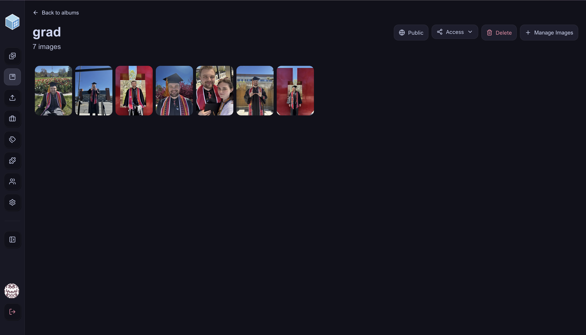

This shows you the images currently available in the album. Assuming you are the owner (creator) of the album, then you will have options to modify the album, if you are just a viewer then these options won't be visible to you.

The Public/Private button determines the default visibility of the album. Public albums are visible by-default to anyone marked "Blacklisted" on the [Accounts](./use_cases.md#adding-new-accounts) page. "Whitelisted" accounts cannot see any images, except for images that are in albums they are explicitly marked as "Viewer" on. Private albums are not visible to either Blacklisted or Whitelisted accounts by-default. Users marked as "All" can see all public and private albums always, this is meant to be an admin-level setting. The logic is that Blacklisted accounts must be blacklisted from albums they shouldn't see, while whitelisted accounts must be whitelisted into albums/images they should see.

The Access button allows you to modify the permissions of an album beyond the Public/Private Whitelisted/Blacklisted defaults. 

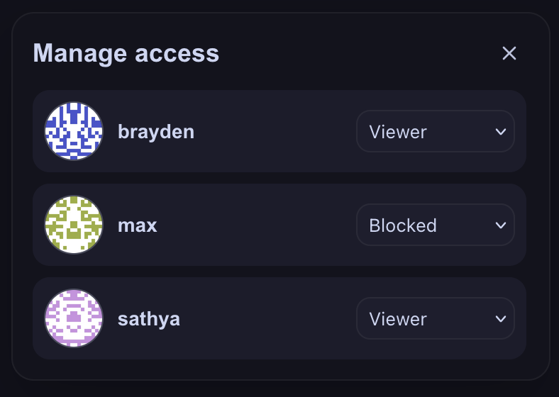

Accounts marked as "Viewer" here can see the album, while accounts marked as "Blocked" cannot see the album. It is important to note that users who are Blacklisted can still see the images in an album they are blocked from, but they cannot see the existence of an album. Whitelisted users are the only users who cannot see images in albums they are blocked from. Users marked as All can always see all albums, even if an album marks them as blocked.

On the album page, it is also possible to delete the album, and use "Manage Images" to add new images to the album in bulk, similar to the operation of [Modify Images in Batches](./use_cases.md#modify-images-in-batches).

## Adding New Accounts

Especially if you would like your instance to be used by multiple people, user accounts are a powerful tool for protecting data and streamlining use of the app. To add an account, navigate to the Accounts page:

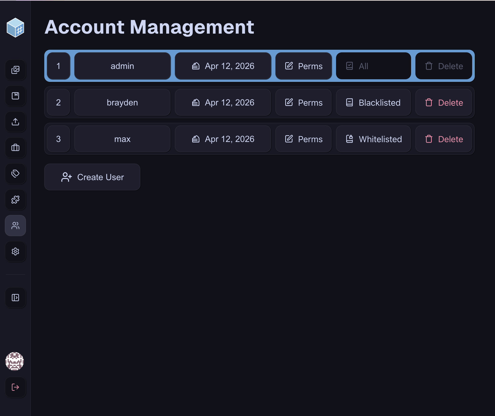

From here, you can view all users on the instance and modify their permissions, album access, and even delete accounts. To create a new account, simply click "Create User" and view this panel:

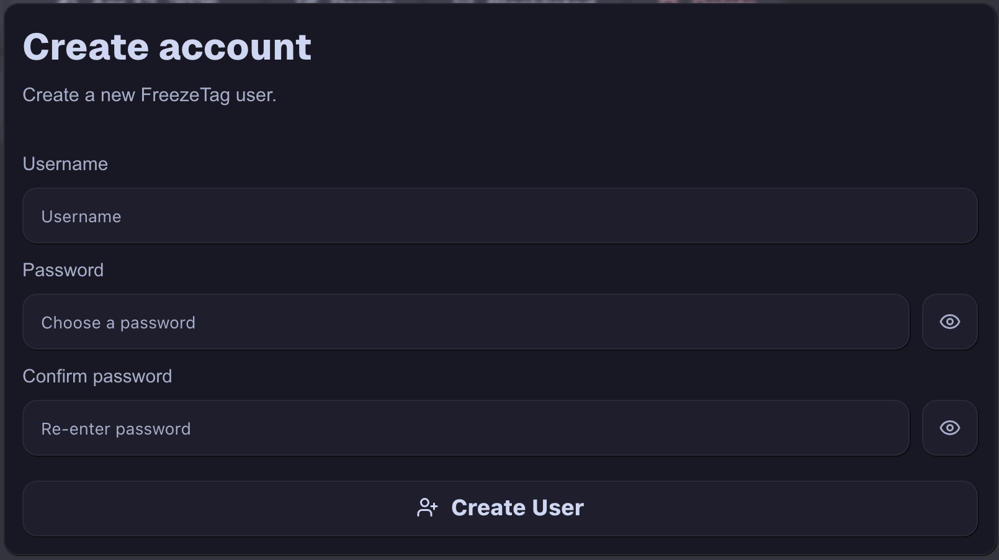

Here, you can give the username for your new account, as well as provide a password. This will form the login credentials for the new account, and if you intend to give this account to someone, it is wise to ask them to change their password after first sign-in. Once their details are filled in, click "Create User" on this panel and the new user will appear in the instance. They will receive some basic read-only permissions and be blacklisted from albums by default. To modify their permissions, click on the "Perms" button in their row. This will show a new panel:

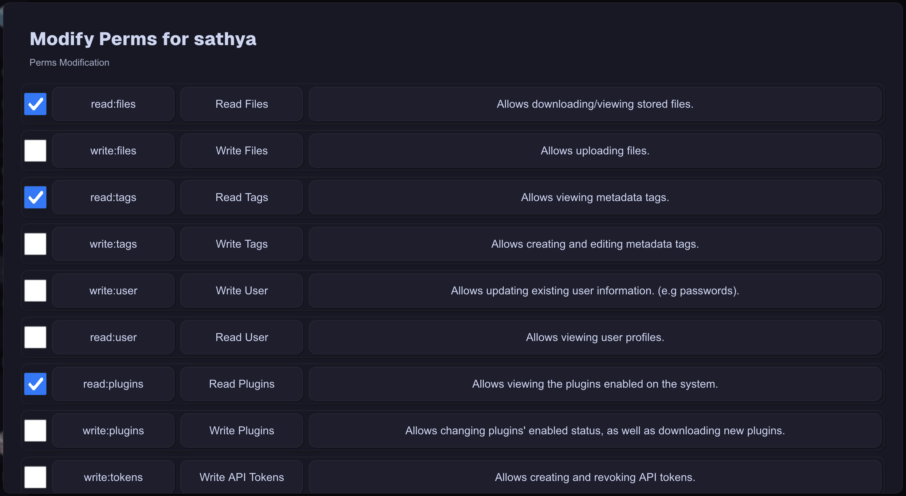

Each checkbox represents the state of the particular permission. Lacking or having a particular permission will modify what each user is able to do on the app, as well as will change their UI to hide certain features they lack access to. Once you have configured the permissions as you like them, scroll to the bottom of this panel and click the "Submit Changes" button to finalize their new permissions. You can change their default album status simply by clicking the "Blacklisted"/"Whitelisted"/"All" button until it reads what you would expect. There are more details about what album lists mean in [Albums](./use_cases.md#albums).

## Changing your Password

There are many reasons to want to change your password, especially when a password is automatically generated or given to you by an admin user. To change your password, navigate to the Settings page, view the Security section, and click "Change Password" to get this view:

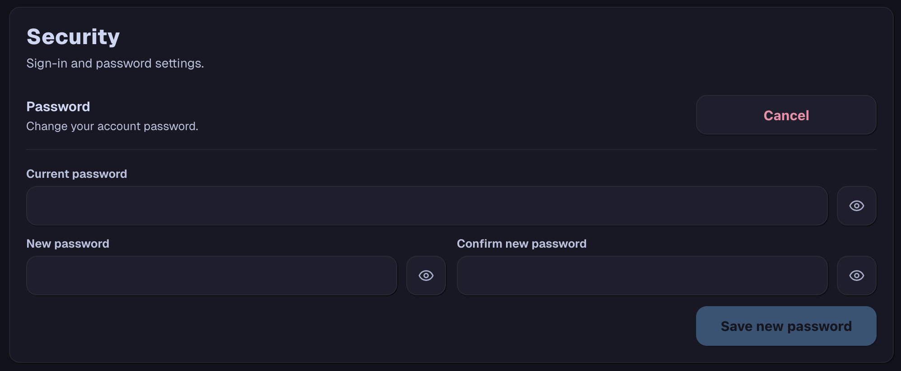

Here, you can enter your original password and the password you would like to switch to, and then click "Save new password". At this time, it is not possible for a password reset request to be completed outside of the relevant account. Admin users can remove and re-add accounts to effectively reset passwords.

## Changing your Profile Picture

By default, FreezeTag generates profile pictures by operating an algorithm on your username. This is similar to Github. Of course, your profile picture can be customized by navigating to the Settings page and using this panel at the top:

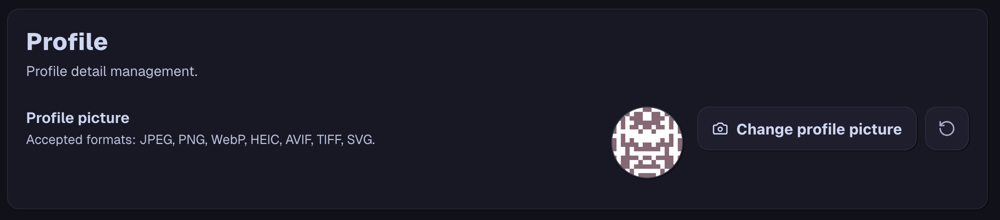

## Jobs Page

This page shows the status of scheduled, running, and finished jobs. Jobs are automatically removed from the page 15 minutes after finishing or being cancelled.

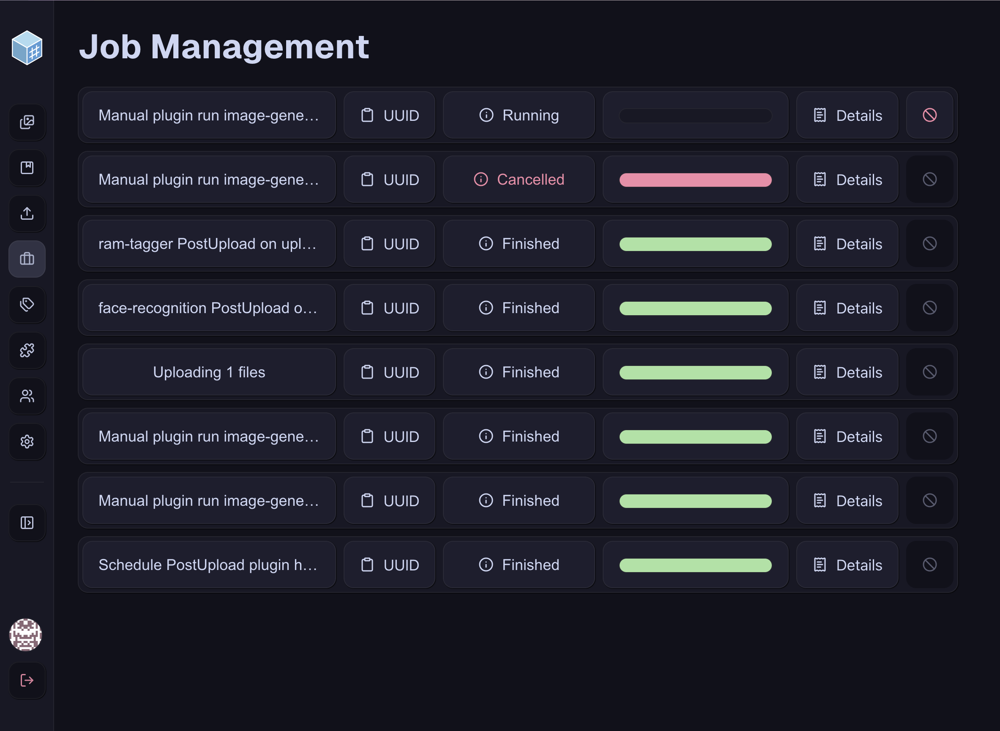

On this page, it is possible to view the status of each job with progress bars. The UUID assigned to each job can be copied to the clipboard, and the details of each job can be read in a panel, however these tasks are mostly geared towards developers for debugging their plugins. With adequate perms, users can also cancel a job mid-run.

## Tags Page

This page shows all tags present on the instance.

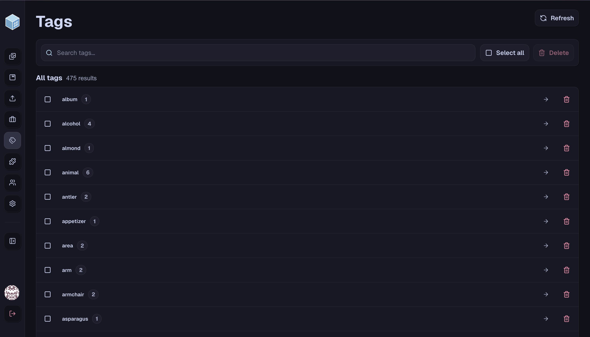

You can use the search bar to filter tags. Tags can be selected with the "Select All" button, and/or by clicking the checkbox on each tag. This allows you to delete multiple tags at once, which removes the tags from the instance but does not remove any photos associated with those tags. A Refresh button is provided in case of inconsistencies caused by multiple users modifying tags at once. If you click the arrow or text associated with each tag, it will switch to the main gallery with those tags in the search bar.

## Color Themes

By default, FreezeTag uses your browser's settings to determine whether it should be in light mode (using Catppuccin Latte) or dark mode (Catppuccin Mocha). This can be modified in the Preferences section of the Settings page.

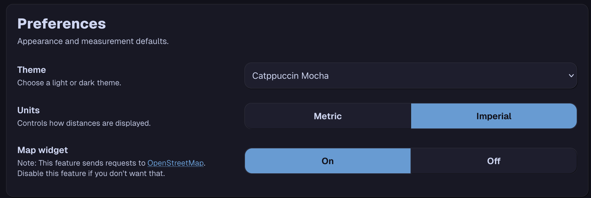

You can use the dropdown menu to select your preferred theme. We support the basic Catppuccin themes (Mocha, Macchiato, Frappe, and Latte), variations of Mocha and Latte that are designed to work for colorblind users, high contrast themes, and Microsoft Hot Dog Stand.

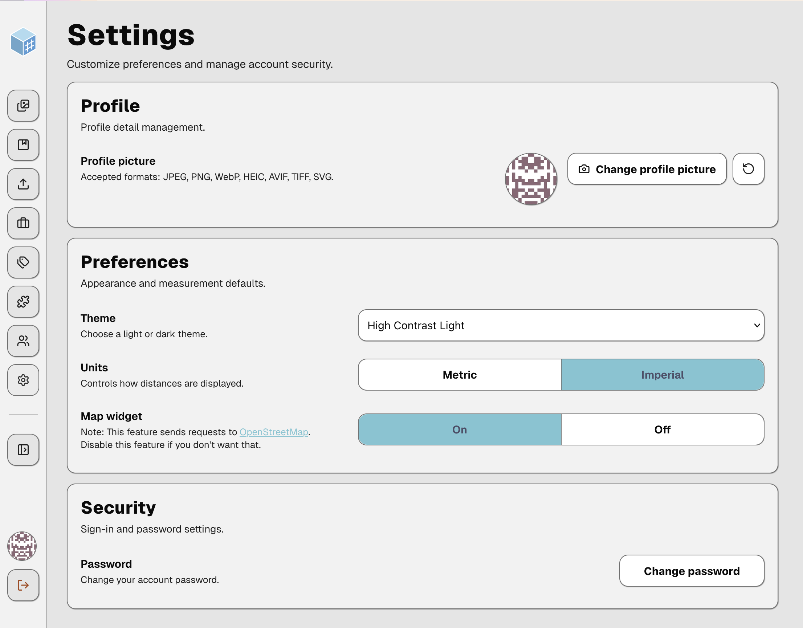

If you would like to customize the theme you use, you can select either Custom option and apply your theme changes as you would like. Variables are provided for every color we use in the app, so you can customize as you see fit.

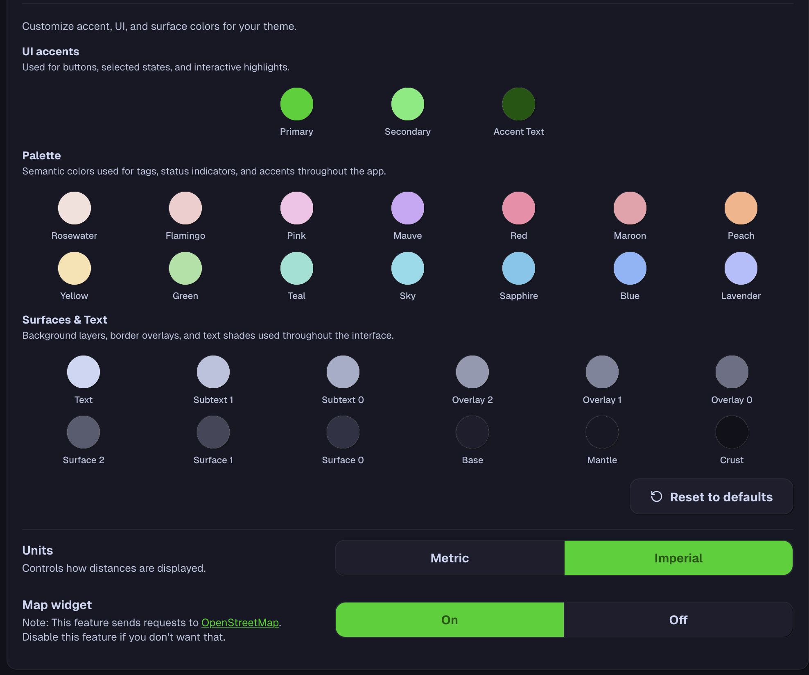

## Next Steps

This section primarily covers user documentation. In the future, we're going to add developer documentation to improve the resources available for people to contribute to our app and write plugins.
